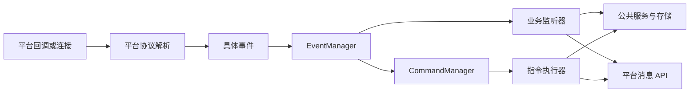

# 架构与生命周期

[文档目录](../README.md) · [平台与消息](platforms.md)

## 模块关系

平台适配层负责协议、连接与原始数据转换。事件层负责调用已注册监听器。指令层从特定平台事件构造发送者并选择执行器。业务逻辑主要位于 `function`，通用服务位于 `service`

WebUI 与 Miniapp 通过 Javalin 接口访问业务服务，不经由文本指令解析。插件使用宿主提供的事件、指令、数据库和调度接口扩展功能

## 主要边界

| 模块 | 职责 |
| --- | --- |
| `platform` | 平台连接、协议解析、User / Message 子类 |
| `chat` | 发送、撤回及平台消息组件 |
| `event` | 类型注册、优先级、事件分发 |
| `command` | 命令声明、发送者、文本与 Slash 执行器 |
| `auth` | 账号绑定、机器人权限、临时登录 |
| `service` | 调度、线程、HTTP、AI 等公共能力 |
| `database` | 连接池与持久化访问 |
| `plugin` | JAR 加载、插件上下文和资源清理 |
| `function` | 业务指令、监听器、推送与游戏 |

项目包含多套调度方式及部分静态服务。具体模块的初始化和关闭由宿主组织，公共接口以当前源码为准

## 启动

入口为 [Atri](../../src/main/java/top/yzljc/atribot/Atri.java)：

1. 构造宿主，读取配置，创建平台管理器、HTTP 服务及路由
2. `onEnable()` 注册核心事件监听器和命令执行器
3. 初始化用户、群、消息记录、账号及各业务 Repository
4. 启动定时任务和已启用的辅助服务
5. 加载并启用 `plugins/` 中的插件
6. `main()` 启动 KOOK、QQ、Discord 平台管理器，启动控制台

HTTP 监听早于全部业务初始化完成。平台回调是否可处理业务事件，由对应适配器的就绪检查决定

插件 `onEnable()` 在平台连接启动前执行，适合注册监听器、命令和任务。此时不能假定平台已经登录或可以发送消息

## 关闭

`Atri.onDisable()` 使用状态标记避免重复关闭，停止入站事件处理与页面会话，停用插件，关闭平台连接、调度器、HTTP 服务、CLI 客户端和共享线程服务

插件释放由 `PluginManager` 和 `PluginContext` 管理。业务自行创建的资源需要接入关闭流程，插件可通过 `context.manage(...)` 登记

## 并发

`EventManager.callEvent()` 在调用线程同步执行。平台适配器可以先将事件投入自己的队列，因此监听器收到事件的线程取决于事件来源

公共异步执行入口为 `ThreadManager`，使用有界队列和受限并发。耗时处理、背压和资源生命周期详见 [运行时服务](runtime.md)
