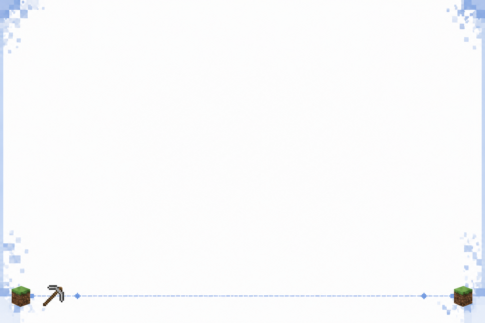
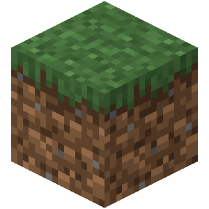

在我们项目的基础上，继续制作一个新的机制，我们的设计要点如下：
在 [SignRepository.java](../src/main/java/top/yzljc/atribot/database/repo/SignRepository.java) 中，我们有这样一个字段，叫 total_coins ，这个字段
我们计划调整，请先记住。

规范声明：
    API链接注册到 [ResourcesProperties.java](../src/main/java/top/yzljc/atribot/configuration/ResourcesProperties.java)
    配置文件注册到 [Properties.java](../src/main/java/top/yzljc/atribot/configuration/Properties.java)

工作：
首先我们需要进行一个调整，目前，对于API的访问，我们用的是 parm key参数验证的方式，正如 [EarthOnline.java](../src/main/java/top/yzljc/atribot/function/official/EarthOnline.java) 
（仅做示例，类似的一大堆呢） 所示 String url = ResourcesProperties.EARTH_ONLINE_API + "?key=" + Config.getInstance().getAtribotKeySecret(); 所写的，这种写法十分麻烦，因此我们计划：
对于调用 [ResourcesProperties.java](../src/main/java/top/yzljc/atribot/configuration/ResourcesProperties.java) 中UGC_API的内容，不再使用 parm key 的鉴权方式
而是改用 Header 的方式，对于UGC端的相关内容，在项目 atrimeow-ugc 中，请自行阅读

进行完上述调整，我们的规范声明便多了一条：UGC的调用需要加header鉴权验证，请知晓
注意 [PreImageGenerate.java](../src/main/java/top/yzljc/atribot/function/general/impl/PreImageGenerate.java) 中有关 HTTPSERVICE 的调用是全局用的，
你不能去改他，header自己在 PreImageGenerate 类内加，你可以为 [HttpService.java](../src/main/java/top/yzljc/atribot/service/request/HttpService.java) 扩展一个
工具方法，但是不要瞎改触及多个全局调用的方法，除非你有足够自信处理好，且使项目内容分明

然后是新的制作：
    以下部分是BOT端的应用逻辑：
        这是一个类似于抽卡的内容，但锁抽卡片不是别的，而是一些MC的物品，当然，你不需要知道和在意一些内容，你需要做的：
        新建一个user_loots表，其数据结构为 user_id, loots（存已获取的）, coins（由上面我所提到的 total_coins 迁移过来，迁移相关的工具函数应当单独分开写，便于开发者后续对其进行删除
        loots的结构应该是这样的：
`        {
[{
"item_id": "随机生成的uuid", 
"display_name": "物品123"， 
"receive_timestamp": "秒级时间戳", 
"way": "获取途径，比如，管理员赠与，补发，或者是抽奖等"
]}
}`
        如果字段内容有缺失，可以补充
        我们的所有物品来自 UGC 端的 GET /atrimeow/loots 接口，他将会下发一个清单数据，告诉我们当前注册了多少的物品卡，结构例如（注意，这个json数据也涉及到一个本地json存储，所以自行斟酌
哪些需要返回哪些不需要，哪些是本地存储用，因为还涉及到一些webui的事情：
{
"update_time": "",
"amounts": "",
"loots": [
{
"item_id": "uuid",
"create_timestamp": "",
"resource_way": "这里是物品卡图片的名字，用来绘图的时候和前端用",
"hash": "哈希怎么能少"
}
]
}
        有没有其他字段我暂时想不到，你自己看着办吧
        然后WEBUI呢也是，参考当前WEBUI的设计，做一个页面，里面有卡片管理，卡片上传（你可能需要让后端自动矫正一下尺寸，卡片描述，每个用户拥有的 coins（我们管这个叫金粒）数量管理和排行（用户需要有有头像显示，参考webui里的
        现有的设计去获取即可，以及对每个用户卡片拥有情况界面的查看，编辑，这个你很擅长的
        次内容只兼容官机即可，Official端，Napcat Discord端不需要兼容，不做
        指令方面，由于QQ 发送内容我得根据实际情况跳帧，你不需要做与用户交互端，比如onCommand等部分，我自己写即可，你需要做的是，给我一个触发抽卡的函数，需要消耗金粒的和不需要消耗的（我现在的计划是每天有一次免费机会，至于具体怎么设计，你无需在意）
    UGC端：
        我们的用户数据等都存在bot端的数据库里，UGC端需要做的是，用MINECRAFTAE字体绘制图片，提供一个POST接口，后转接给 DUMP 接口 GET获取（和当前项目内思路保持一致即可），然后就是一些我们先前提到的webui端的上传删除啊编辑的一些逻辑的接口
注意，必须写像 [Config.java](../src/main/java/top/yzljc/atribot/configuration/Config.java) 里给 imagesource 调用UGC端的
@Getter
private String imageSourceToken;
等 HEADER KEY鉴权，不然会被人家搞死的，万一不小心被劫持就死了，过我们是https，这点安全还是可以的，重要的是你需要做好你的逻辑保护，也就是密钥方式

对于图片绘制，我相信你有视图能力，这里我提供了一个参考图给你  这是背景图，文字，卡片内容，介绍，名字，都是你自己画，我这里为你提供一个示例物品
 介绍：制作于2009年，Minecraft的第一个方块，草方块是Minecraft世界中最常见的方块之一。 在用户卡片获取情况中，不写介绍，致谢名字和画物品卡片图即可
但是还有一个接口，是单次抽奖返回，需要有介绍，类似于我需要让用户看到一次介绍，但是总览是不需要的，你应该懂的，卡片怎么绘制，你应该也很清除，怎么做比较好看，物品图尺寸的裁剪，你应该也是会的对吧

至此，工程完毕，描述中可能有部分遗漏细节，以及在你可能的测试中由于没有数据库你也没法实际测试，请自行解决
项目指引:  AtriMeow - BOT端
         atrimeow-ugc - UGC端
        
        